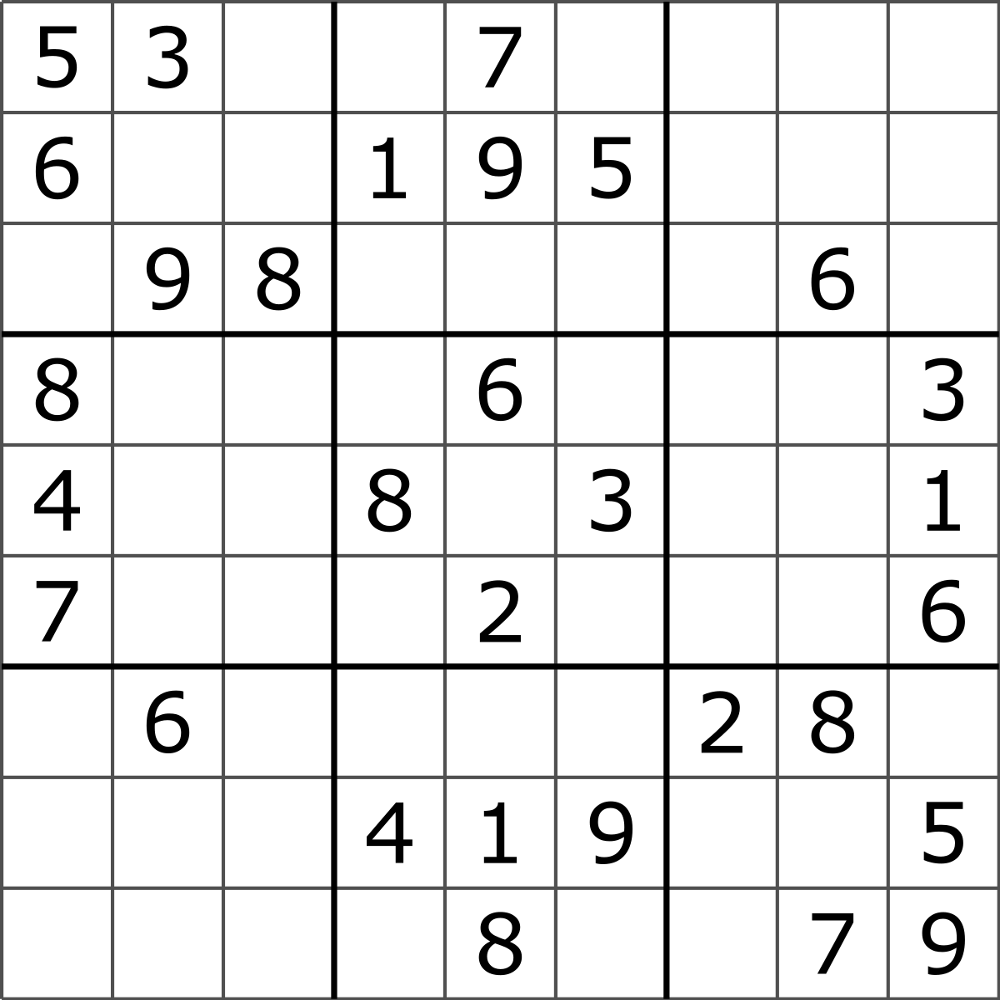
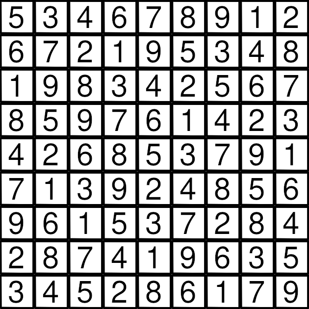

# sudoku-solver[WIP]
Feed in a image of a sudoku and get it solved!

## Instructions
1. Install opencv, tesseract and numpy
2. Execute main.py 

## Examples
### Unsolved Sudoku

### Computer generated solved sudoku

